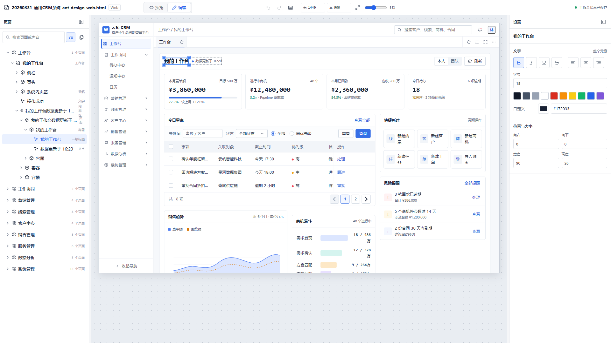
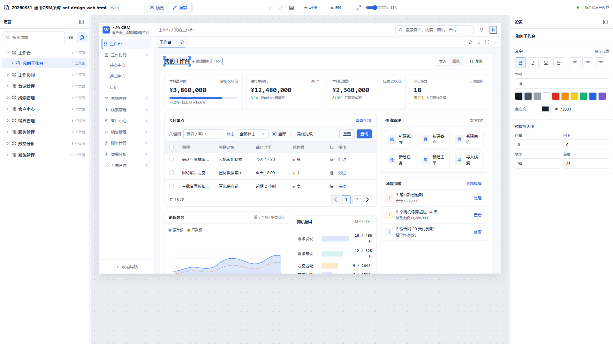
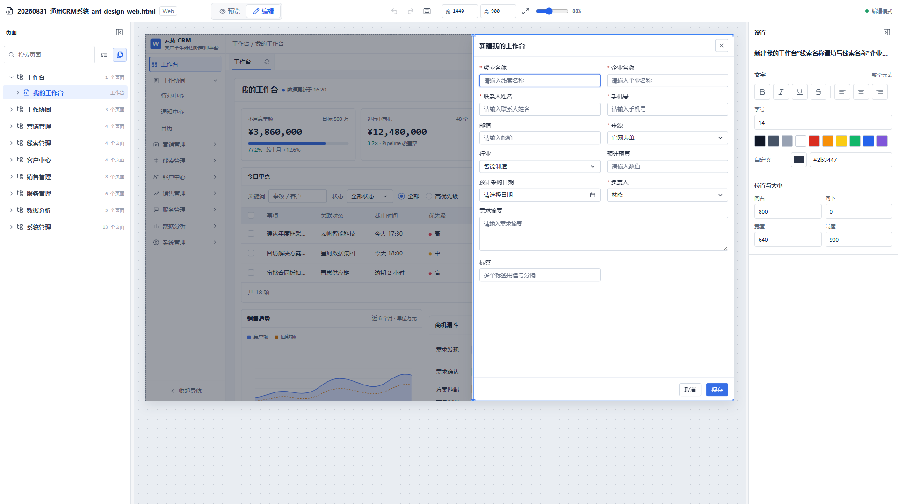
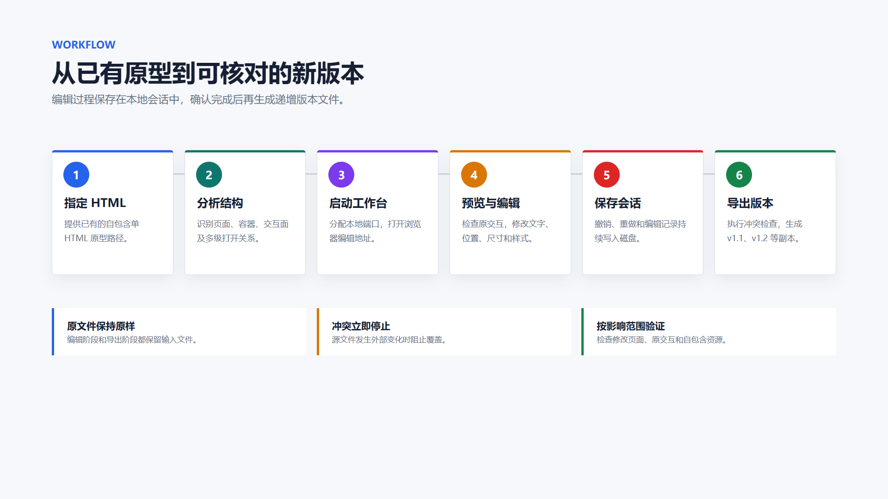
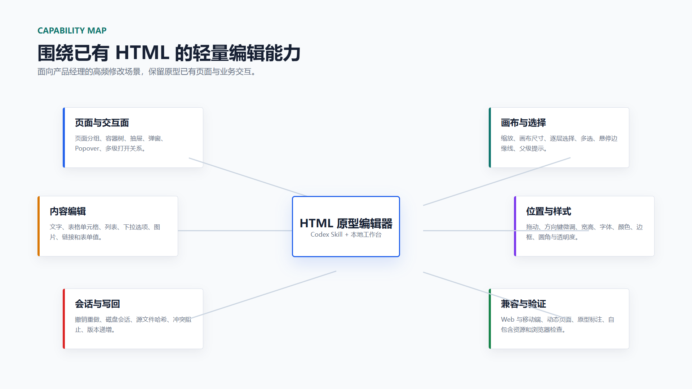
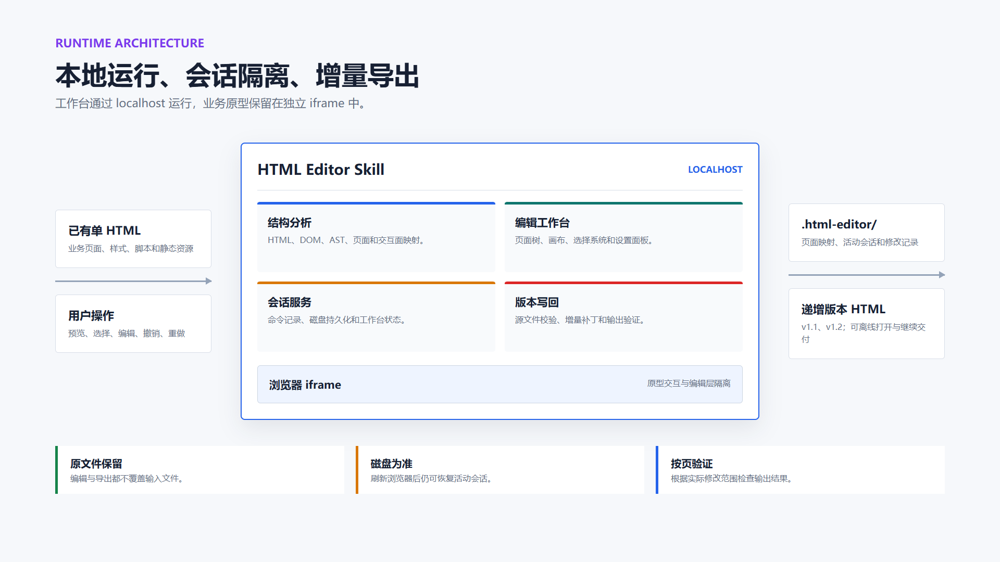

# HTML 原型编辑器（Prototype HTML Editor）

[](https://github.com/lin96008-maxlin/prototype-html-editor/actions/workflows/ci.yml)
[](./LICENSE)
[](./html-editor/SKILL.md)
[](#最终交付是什么)


面向产品经理的已有单 HTML 原型编辑工具。

产品原型进入评审后，经常只需要改一段文字、调整一个组件位置、删掉一行数据或修正弹窗内容。直接修改源码需要理解 HTML、CSS 和 JavaScript，重新生成整份原型又容易影响已经确认的页面和交互，让 AI 改又要等老半天。

Prototype HTML Editor 通过 Codex Skill 启动本地工作台，在浏览器中完成页面定位、文字编辑、位置与尺寸调整、表格和下拉选项修改。编辑过程写入独立会话，确认完成后生成递增版本 HTML，输入文件始终保留。

**核心定位：在浏览器中修改已有高保真 HTML 原型，保留原交互，通过版本副本完成交付。**
** [编辑模型在线演示](https://www.pm-vibe.com/demo/share/20GrlY9H/)**

## 核心价值

- **降低已有原型修改成本**：常见文案、表格、列表、下拉选项、图片、位置和尺寸可以直接在画布中处理。
- **页面与交互保持可定位**：页面、容器、组件、抽屉、弹窗和多级交互按真实关系进入左侧目录。
- **预览与编辑随时切换**：预览模式保留业务交互，编辑模式用于选择和调整页面内容。
- **修改过程可撤销**：编辑命令持续写入磁盘，浏览器刷新后可以恢复当前会话。
- **输入文件始终保留**：完成编辑后生成 `v1.1`、`v1.2` 等递增版本，便于核对和回退。
- **兼容多种单 HTML 写法**：结合 HTML、DOM、JavaScript AST 和运行状态识别页面及交互面。

## 功能展示

> 以下截图来自通用 CRM 演示原型，使用 `1920×1080` 浏览器视口。

### 预览模式：完整运行原型

预览模式隐藏编辑栏，原型按桌面画面自适应显示。导航、系统页签、表单、弹窗和原有 JavaScript 可以继续操作。


### 编辑模式：页面树、画布和设置栏

左侧按页面、容器和组件展示目录；中间画布用于选择、拖动和调整尺寸；右侧集中处理文字、颜色、位置和大小。



### 仅页面目录：减少长页面的信息量

左侧目录支持完整目录和仅页面两种模式。仅页面模式适合页面较多、内部结构较深的原型，画布选择仍会定位到所属页面。



### 抽屉与弹窗：进入真实交互面编辑

工作台可以识别页面内的抽屉、弹窗和多级交互。点击目录节点后先打开原型自身交互，再选中对应内容。



## 工作方式



1. 用户在 Codex 中指定已有 HTML。
2. Skill 分析页面、容器、组件和交互面。
3. 本地服务分配可用端口并打开工作台。
4. 用户在预览与编辑模式之间切换，操作持续写入活动会话。
5. 用户回到对话中要求应用修改。
6. Skill 检查源文件冲突，生成递增版本并验证受影响页面。

## 主要能力

| 领域 | 能力 |
| --- | --- |
| 页面识别 | 显式页面标记、路由属性、菜单配置、动态模板、系统页签和页面分组 |
| 交互面识别 | 抽屉、Dialog、Bottom Sheet、Popover、复用浮层和多级父子关系 |
| 页面目录 | 完整目录、仅页面目录、搜索、自动展开、自动收起和画布双向定位 |
| 画布选择 | 单击逐层选择、`Ctrl+单击`多选、框选、父级提示和悬停边缘线 |
| 内容编辑 | 文字、表格单元格、列表、下拉选项、按钮文案、输入值、占位文字、图片和链接 |
| 样式调整 | 字号、加粗、斜体、下划线、删除线、文字颜色、背景、边框、圆角和透明度 |
| 位置与尺寸 | 鼠标拖动、方向锁定、方向键微调、宽高输入和画布缩放 |
| 结构操作 | 复制、剪切、粘贴、重复、删除和多选对齐 |
| 会话管理 | 磁盘会话、撤销、重做、刷新恢复和活动 session 状态 |
| 版本写回 | 源文件哈希、冲突阻止、递增版本命名、增量补丁和输出验证 |

## 能力结构



## 安装

### 环境要求

- 已安装并可使用 Codex；
- 已安装 Python 3，用于运行 Codex 内置 Skill 安装器；
- 已安装 Node.js 18 或更高版本。

仓库已包含预构建工作台。日常调用无需执行 `npm install`。

### 方式一：使用 Codex 内置安装器

PowerShell：

```powershell
python "$HOME\.codex\skills\.system\skill-installer\scripts\install-skill-from-github.py" `
  --repo lin96008-maxlin/prototype-html-editor `
  --path html-editor
```

macOS / Linux：

```bash
python ~/.codex/skills/.system/skill-installer/scripts/install-skill-from-github.py \
  --repo lin96008-maxlin/prototype-html-editor \
  --path html-editor
```

安装器会将 Skill 放到 `~/.codex/skills/html-editor`。安装完成后请新建 Codex 任务，使 Skill 进入新任务上下文。

### 方式二：手动安装

PowerShell：

```powershell
git clone https://github.com/lin96008-maxlin/prototype-html-editor.git
New-Item -ItemType Directory -Force "$HOME\.codex\skills" | Out-Null
Copy-Item -Recurse ".\prototype-html-editor\html-editor" "$HOME\.codex\skills\html-editor"
```

macOS / Linux：

```bash
git clone https://github.com/lin96008-maxlin/prototype-html-editor.git
mkdir -p ~/.codex/skills
cp -R ./prototype-html-editor/html-editor ~/.codex/skills/html-editor
```

## 使用方式

### 打开已有原型

在 Codex 中发送：

```text
使用 $html-editor，打开 C:\path\to\prototype.html 进行编辑。
```

Skill 会返回实际 `editUrl`。端口由本地服务动态分配。

### 编辑原型

- 单击画布逐层选择容器和组件；
- `Ctrl+单击`直接选择或加入多选；
- 双击包含文字的组件进入文字编辑；
- 拖动选中对象调整位置；
- 拖动四边和四角调整尺寸；
- 使用右侧设置栏修改内容、样式、位置和大小；
- 使用左树切换页面、抽屉和弹窗。

### 应用本轮修改

完成编辑后回到 Codex 对话并发送：

```text
使用 $html-editor，应用本轮修改并导出新版本。
```

Skill 会读取活动会话、检查输入文件、生成递增版本，并返回输出路径和验证结果。

## 常用快捷键

| 快捷键 | 操作 |
| --- | --- |
| `Ctrl+Z` | 撤销 |
| `Ctrl+Y` / `Ctrl+Shift+Z` | 重做 |
| `Ctrl+C` / `Ctrl+X` / `Ctrl+V` | 复制、剪切、粘贴 |
| `Ctrl+D` | 重复选中对象 |
| `Delete` / `Backspace` | 删除 |
| `Enter` | 编辑选中文字 |
| `Esc` | 退出文字编辑或清除选择 |
| `方向键` | 移动 1px |
| `Shift+方向键` | 移动 10px |
| `Shift+拖动` | 锁定水平或垂直方向 |
| `Ctrl+S` | 保存当前文字编辑和工作台状态 |
| `Ctrl+E` | 切换预览与编辑 |
| `Ctrl+滚轮` | 缩放画布 |
| `Ctrl+0` | 适应窗口 |

输入框、下拉框和文字编辑区获得焦点时，浏览器原生快捷键优先。

## 最终交付是什么

编辑阶段保留输入 HTML。用户确认完成后，Skill 在同一目录生成新文件：

```text
prototype.html
prototype-v1.1.html
prototype-v1.2.html
```

输出文件包含原型已有内容和本轮修改，不包含编辑器界面或活动会话。它可以直接用浏览器打开，也可以上传到静态托管平台。

## 本地编辑数据

编辑服务会在原型旁创建：

```text
.html-editor/{prototypeKey}/
├─ manifest.json
├─ page-map.json
└─ sessions/{sessionId}.json
```

`page-map.json` 保存页面及交互面映射，`sessions/` 保存修改命令和工作台状态。目录可能包含业务原型中的文字与结构信息，请按项目要求管理。

## 支持范围

适合：

- 已有 Web 或移动端自包含单 HTML 原型；
- 页面和交互已经完成，需要集中修改内容与布局；
- 希望保留输入文件，并通过递增版本完成评审；
- 需要继续使用已有 Tab、弹窗、抽屉、表单和 JavaScript 交互。

当前边界：

- 编辑工作台面向桌面浏览器；
- Canvas、WebGL、跨域 iframe 和框架虚拟 DOM 内部内容按整体对象处理；
- 业务事件、条件和动作配置沿用原型已有实现；
- 大型组件库和完整页面搭建能力暂未提供。

## 目录结构

| 路径 | 用途 |
| --- | --- |
| `html-editor/SKILL.md` | Skill 入口、任务路由、操作边界和验证要求 |
| `html-editor/agents/` | Codex 中的名称、说明、默认提示和显式调用策略 |
| `html-editor/assets/editor-app/` | 可直接运行的预构建本地工作台 |
| `html-editor/scripts/` | 分析、启动服务、会话、导出和验证命令 |
| `html-editor/src/` | React 工作台与本地服务源码 |
| `html-editor/references/` | 页面、交互面、元素目标和写回契约 |
| `html-editor/tests/` | 页面、路由、交互面和写回回归夹具 |
| `docs/images/` | README 截图、流程图和结构图 |
| `docs/diagrams/` | 流程图和结构图的可再生成 HTML 源文件 |
| `.github/` | 持续集成、贡献指南和安全说明 |

## 运行架构



## 技术说明

- React、TypeScript、Zustand 构成本地工作台；
- Acorn 和 parse5 用于 JavaScript AST 与 HTML 分析；
- 页面和交互面识别结合静态分析、运行时 DOM 与 MutationObserver；
- session 文件是编辑阶段的数据来源；
- 写回采用局部补丁与运行时补丁数据，避免重新序列化整份 HTML；
- `assets/editor-app/` 已提交构建产物，安装 Skill 后可以直接启动。

## 本地开发

```bash
cd html-editor
npm ci
npm run typecheck
npm test
npm run build
```

当前回归覆盖页面识别、复用模板、动态路由、交互面归属、多级父子关系、局部写回、运行时补丁、冲突恢复和自包含注入。

## 安全与隐私

- 请勿提交 `.html-editor/`、真实客户原型、内部地址、账号、密钥或 Token；
- localhost 编辑地址只在本机使用；
- 输入 HTML 和 session 可能包含完整业务信息；
- 导出文件外发前应完成内容、权限和数据边界检查；
- 安全问题请通过 [GitHub Private Vulnerability Reporting](https://github.com/lin96008-maxlin/prototype-html-editor/security/advisories/new) 私下反馈。

## 相关项目

- [Prototype Annotation](https://github.com/lin96008-maxlin/prototype-annotation)：为单 HTML 原型补充业务标注和跨页面原型说明。
- [原型 HTML 托管平台](https://github.com/lin96008-maxlin/prototype-html-hosting-platform)：管理、预览和分享 HTML/Axure 原型资产。
- [问卷式 PRD 撰写](https://github.com/lin96008-maxlin/prd-outputs-interactive)：通过交互式澄清整理和更新 PRD。

## 参与贡献

欢迎产品经理、设计师和开发者提交真实使用场景、兼容问题和交互改进。提交代码前请阅读 [贡献指南](./.github/CONTRIBUTING.md)，并确保测试材料已经脱敏。

## 开源许可

本项目自研部分采用 [MIT License](LICENSE)。第三方组件的许可证与归属见 [THIRD_PARTY_NOTICES.md](THIRD_PARTY_NOTICES.md) 和 `html-editor/assets/licenses/`。
